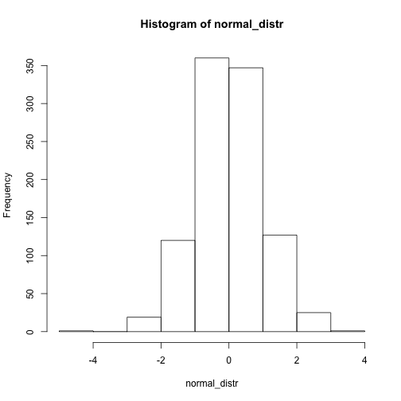
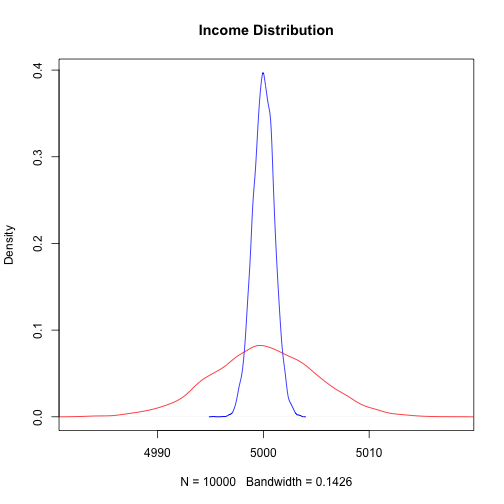

<style>
body {
    overflow: scroll;
}
</style>


Berkstats
========================================================
author: Ulrich Matter   
date: February 2017
autosize: true

R
========================================================

- Multi-paradigm programming language
- Software environment for statistical computing
- Powerful graphics engine


```r
print("Hello world")
```

```
[1] "Hello world"
```


Why R?
========================================================

- Open source -> open science
- Large active community
- Large number of packages (modules)


```r
plot(cars)
```


Variables and Vectors
========================================================


```r
a <- c(1,22,333)
names(a) <- c("Andy", "Betty", "Claire")
print(a)
```

```
  Andy  Betty Claire 
     1     22    333 
```

```r
print(a[3])
```

```
Claire 
   333 
```

Random Draws and Distributions
========================================================


```r
normal_distr <- rnorm(1000)
hist(normal_distr)
```




Mean, Median, Mode
========================================================

- mean()
- median()
- ...


Compute the mean
========================================================


```r
a
```

```
  Andy  Betty Claire 
     1     22    333 
```

```r
sum(a) / length(a)
```

```
[1] 118.6667
```


Compute the median
========================================================


```r
middle <- length(a)/2
a[middle]
```

```
Andy 
   1 
```


Why variability matters
========================================================


```r
largevar <- rnorm(10000, mean = 5000, sd = 5)
littlevar <- rnorm(10000, mean = 5000, sd = 1)
plot(density(littlevar), col = "blue", 
     xlim=c(min(largevar), max(largevar)), main="Income Distribution")
lines(density(largevar), col = "red")
```




Measures of variability
========================================================


```r
range(a)
```

```
[1]   1 333
```

```r
var(a)
```

```
[1] 34564.33
```

```r
sd(a)
```

```
[1] 185.9149
```


Compute the Standard Deviation
========================================================


```r
sqrt(sum((a-mean(a))^2) / (length(a) - 1))
```

```
[1] 185.9149
```

```r
sd(a)
```

```
[1] 185.9149
```


Skewness and Kurtosis
========================================================


```r
library(moments)
kurtosis(largevar)
```

```
[1] 3.032023
```

```r
skewness(largevar)
```

```
[1] -0.05329111
```

```r
largevar[largevar>mean(largevar)] <- largevar[largevar>mean(largevar)] + 3000
skewness(largevar)
```

```
[1] 0.001999598
```

